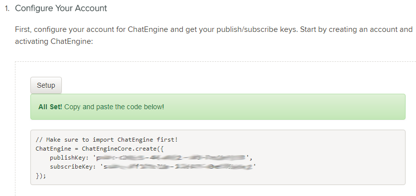
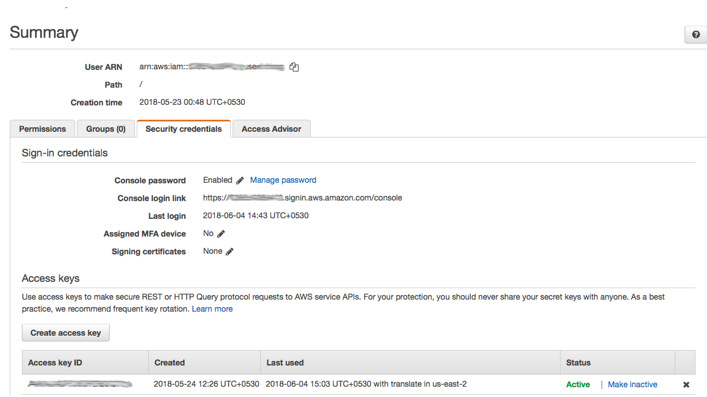

# Speech Enabled Chat App

This repo contains the source code for a sample application that deminstrates how to build accessible apps for chat clients, built with PubNub ChatEngine and Amazon Polly.

The source code for this chat app is in Javascript and python. The UI frontend uses the standard javascript libraries like JQuery, so some level of familiarity with JQuery and standard Javascript language is expected.

For reference, here is the complete documentation of [PubNub ChatEngine](https://www.pubnub.com/products/chatengine/). The Amazon Polly documentation can be accessed in this [link](https://aws.amazon.com/polly/).

Follow the steps below the build and locally deploy this app. However, before you begin, you must have an account in PubNub and AWS.

1. Create your [PubNub developer account](https://admin.pubnub.com/)

2. Create your free [AWS account](https://portal.aws.amazon.com/billing/signup#/start)

## [Setup Basic ChatEngine App](#setup-basic-chatengine-app)

### Step 1 : Login to your [PubNub App Console](https://admin.pubnub.com/)

### Step 2 : Activate ChatEngine in your PubNub account

Follow these steps in [ChatEngine QuickStart Tutorial](https://www.pubnub.com/docs/tutorials/chatengine#step-one-pubnub-keys) to set up your chat app instance. Check the first step "Configure Your Account" in quickstart tutorial and click on the setup button.

### Step 3 : Wait for a few seconds. Once done, you will get a new PubNub app created within your account with a new set of publish and subscribe keys.

### Step 4 : Check that a new app is created in your PubNub admin dashboard.

Now your app infrastucture is created. For enabling speech feature, head over to the next section.

## [Set Up Amazon Polly Service](#set-up-amazon-polly-service)

Follow these steps to setup your AWS account for accessing Amazon Polly service

### Step 1 : Setup an IAM user to access AWS Translate service

Follow [these steps](https://docs.aws.amazon.com/polly/latest/dg/setting-up.html) to create an IAM user for AWS Polly. Make sure that the IAM user has full permissions for accessing Amazon Polly service. 

### Step 2 : Download the IAM user credentials

Download the credentials file for the IAM user and save it. This file contains the AWS ACCESS KEY and AWS SECRET KEY.

